# Functional Sequence Diagrams — Accomplish Architecture

> **Companion to** [functional-viewpoint.md](functional-viewpoint.md). That document describes **what** each component is and **how** they connect at a structural level. This one shows **in what order** messages flow across those components, for the three flows where the message order is load-bearing: task start-up, human-in-the-loop gating, and the Free-build LLM-gateway integration.

Each diagram shows only the participants that are active in that phase — participants that only stage data (e.g., `ConfigGenerator`, `ProviderConfigBuilder`) are collapsed into one node so the wire-level interaction stays legible.

## Transport legend

| Annotation            | Mechanism                                                | Direction / shape                          |
| --------------------- | -------------------------------------------------------- | ------------------------------------------ |
| **[IPC invoke]**      | `ipcRenderer.invoke` ↔ `ipcMain.handle` (Electron IPC)   | Renderer → Main, request/reply             |
| **[IPC push]**        | `webContents.send` → `ipcRenderer.on`                    | Main → Renderer, one-way notify            |
| **[JSON-RPC]**        | JSON-RPC 2.0 over Unix socket / Windows named pipe       | Main ↔ Daemon, request/reply               |
| **[JSON-RPC notify]** | `rpc.notify(channel, payload)` on the same socket        | Daemon → Main, one-way                     |
| **[HTTP]**            | OpenCode SDK v2 REST call on `http://127.0.0.1:<random>` | Daemon → `opencode serve`, request/reply   |
| **[SSE]**             | Server-Sent Events stream on the same loopback port      | `opencode serve` → Daemon, streaming push  |
| **[HTTPS]**           | Outbound TLS                                             | `opencode serve` / gateway → external APIs |
| **[spawn]**           | `child_process.spawn`                                    | OS process creation (not a wire protocol)  |

There is **no WebSocket anywhere** in the system — the SDK event channel is SSE, not WS.

---

## Overview — the two canonical round-trips

Before the per-phase diagrams, here are the two flows at the lowest useful granularity: a **task request** (user kicks off work, events stream back to the UI) and a **permission gate** (agent asks to do something risky, user responds). Both round-trips cross every process boundary in the system. The diagrams below compress each to four or five participants. Sections 1, 2, and 3 expand every hop.

### Task request — end to end

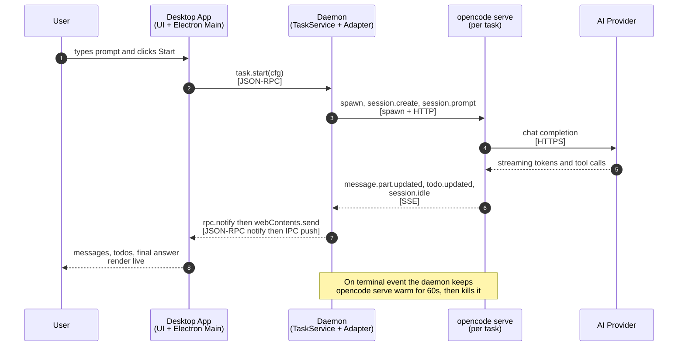

The per-hop breakdown is in §1 (six phases).

### Permission gate — end to end

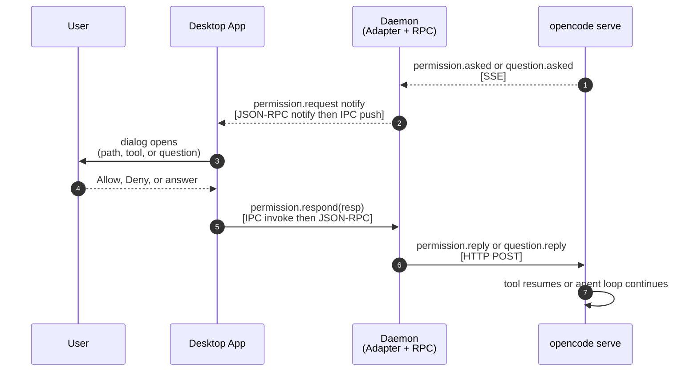

The full round-trip — including the `PendingRequest` ID mapping and the non-UI auto-deny branch — is in §2.

---

## 1. Task start — six phases

A single user action ("run this task") walks six distinct layers — UI/preload, daemon RPC, server pool, SDK adapter, the agent loop itself, and the event fan-out back to the UI. Each phase gets its own diagram so the participant list stays short and the transport shift between phases stays obvious.

### 1a. UI → Daemon (renderer prompt hits JSON-RPC surface)

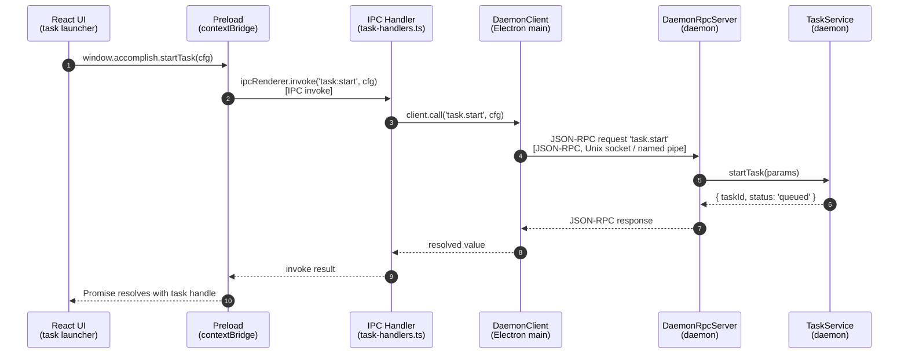

**What this phase does:** converts a UI click into a daemon-side `TaskService.startTask` call, nothing more. No `opencode serve` yet, no LLM. The renderer is guaranteed a `taskId` it can start subscribing events for.

### 1b. Daemon spawns `opencode serve` for this task

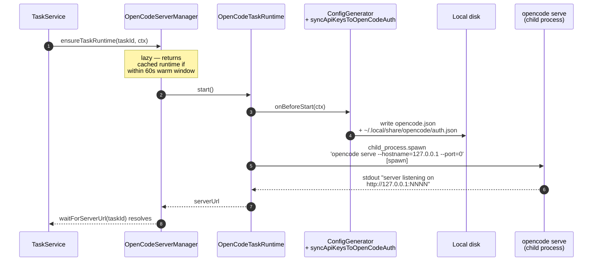

**What this phase does:** lazily starts a per-task `opencode serve` HTTP+SSE server on a random loopback port. The runtime reads its provider credentials and session config from the two files `ConfigGenerator` just wrote — not from env vars.

### 1c. Agent-core adapter wires to the server

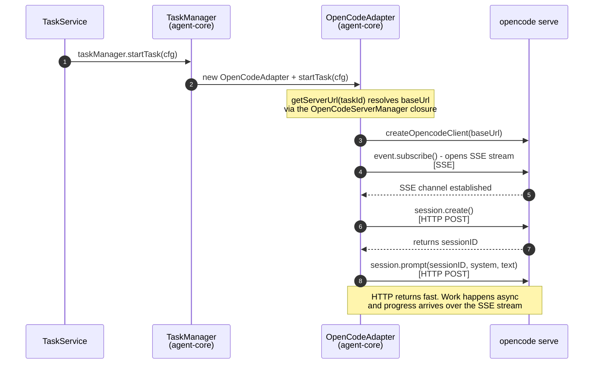

**What this phase does:** the SDK client inside `OpenCodeAdapter` opens the event stream **before** kicking off the first prompt, so nothing is missed. This is the first point in the lifecycle where HTTP and SSE are both live.

### 1d. Execution — `opencode serve` drives tools and the LLM

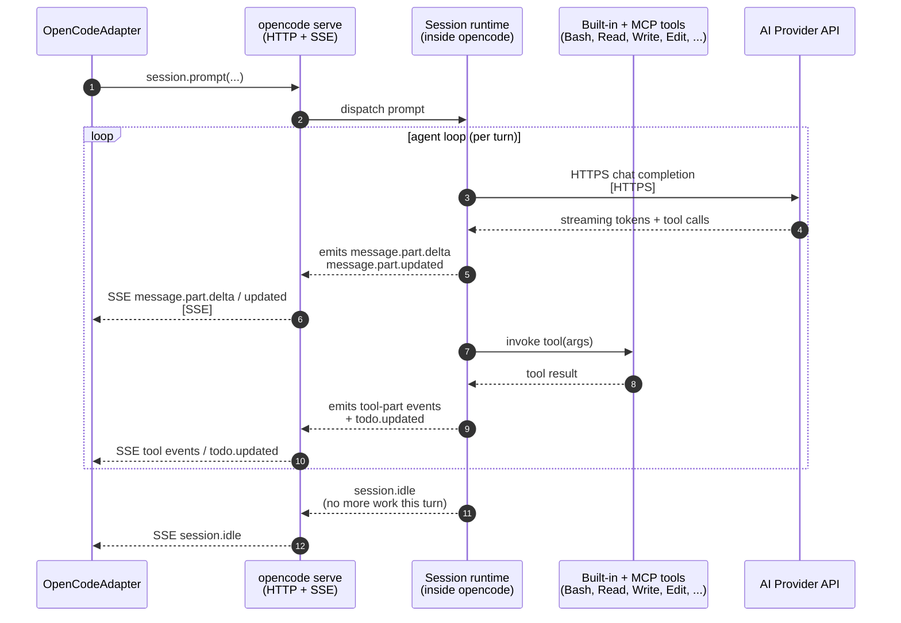

**What this phase does:** everything inside the opencode serve process. Accomplish is a passive observer on the SSE side — it never drives the LLM or the tool calls directly, it just reacts to events.

### 1e. Event fan-out — SSE event to React state

Participants are drawn right-to-left here because the data is flowing _outward_ from the daemon back to the UI — mirroring the direction reversal after §1a–1d went left-to-right.

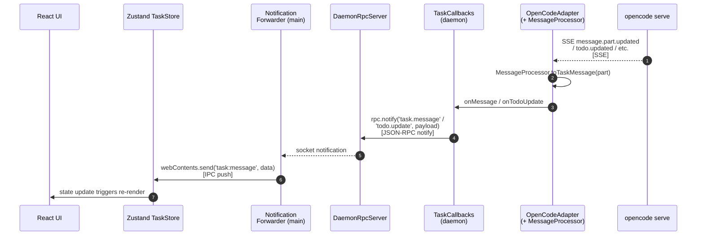

**What this phase does:** translates low-level SDK events into `TaskMessage` shapes the renderer understands, and pushes them into the Zustand store. This is the "typing animation" path users see in the execution page.

### 1f. Teardown & warm-reuse

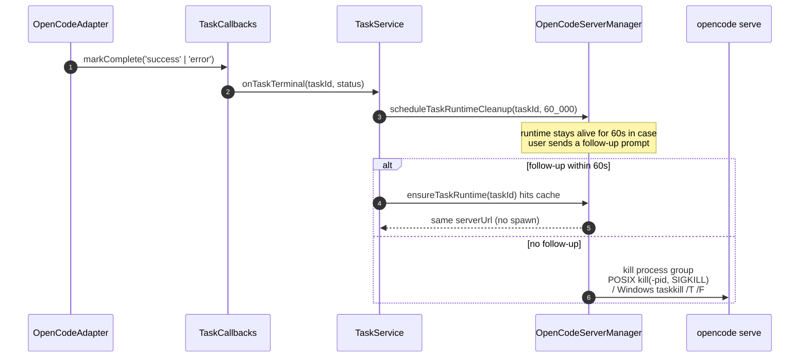

**What this phase does:** keeps the hot-path cost of follow-up prompts near zero while still reclaiming resources when conversations go idle.

---

## 2. Permission & Question gating

Triggered when the agent wants to run a file-mutating tool (`Write`, `Edit`, `Bash`) or explicitly asks the user a clarifying question via `ask-user-question`. The round-trip crosses every layer in the system and back.

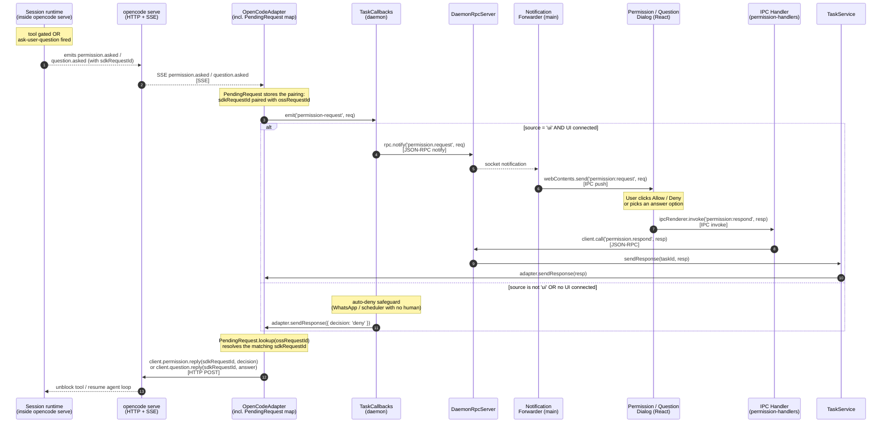

**Key points:**

- **Two IDs, one mapping.** The OSS request ID is what the UI sees. The SDK request ID is what `opencode serve` expects on the reply. `PendingRequest` is the only place both IDs coexist.
- **Reply transport is HTTP, not SSE.** The subscription stream is strictly inbound (`opencode serve → adapter`). Replies go out over the ordinary SDK HTTP methods.
- **Auto-deny is on the same wire.** For non-UI sources (WhatsApp inbound, scheduler-fired task), `TaskCallbacks` invokes `adapter.sendResponse({ decision: 'deny' })` directly — the reply still traverses the same `PendingRequest` → HTTP path, it just skips the RPC/IPC/UI hop.
- **No `:9226` / `:9227` shims.** The HTTP callback servers the PTY era used are gone; the entire gate rides on the SDK's native event model.

---

## 3. LLM-Gateway integration (Free build)

The private package `@accomplish/llm-gateway-client` is loaded via dynamic `import()` at daemon startup. In OSS builds the import fails and `noopRuntime` takes over — every call below becomes a no-op except for `isAvailable()` returning `false`. The two diagrams below only make sense in a Free build.

### 3a. Connect / usage reporting (user-driven)

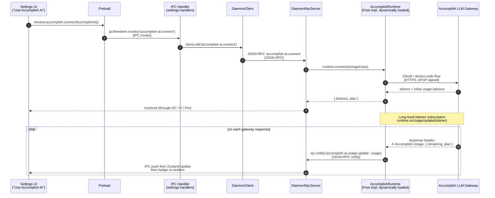

**What this phase does:** the UI opens a device-code / browser flow, exchanges it for credits, and then keeps a live usage counter in sync. `onUsageUpdate` is wired at daemon boot regardless of whether the user is currently looking at Settings — that way any task-driven gateway call refreshes the number silently.

### 3b. Per-task LLM call tagging (hot path)

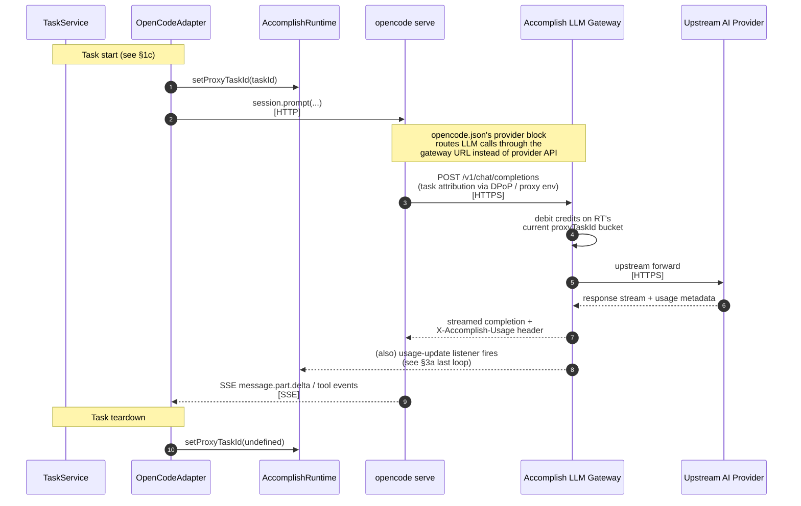

**Key points:**

- **Where the taskId is injected.** `setProxyTaskId` is the single hot-path call between OSS code and the private runtime. It runs at `OpenCodeAdapter.startTask` and again (with `undefined`) at `teardown`. Every gateway-bound LLM request in between gets attributed to that task.
- **OpenCode doesn't know about the gateway.** From `opencode serve`'s point of view it is calling a normal provider endpoint — the swap happens inside the provider config that `buildAccomplishAiConfig` emits. That's why the integration survives OpenCode SDK upgrades without changes.
- **Two usage signal paths.** The response header feeds the in-UI balance; the gateway's own accounting tracks per-task credit spend for rate-limiting and abuse detection.
- **OSS parity.** In the OSS build `setProxyTaskId` is `undefined` (optional-chain short-circuits), `buildAccomplishAiConfig` returns empty, and `accomplish-ai.*` RPCs throw `accomplish_runtime_unavailable`. None of these diagrams' Free-specific arrows fire.

---

## How to read these alongside the other docs

| If you want…                                                    | Read…                                                   |
| --------------------------------------------------------------- | ------------------------------------------------------- |
| The set of components and their responsibilities                | [functional-viewpoint.md](functional-viewpoint.md) §1–3 |
| The list of every transport / channel                           | [functional-viewpoint.md](functional-viewpoint.md) §4   |
| Why `opencode serve` is per-task, 60s TTL                       | [functional-viewpoint.md](functional-viewpoint.md) §5   |
| The message **order** on start / gate / gateway (this document) | §1, §2, §3 above                                        |
| Completion-enforcer state machine                               | [functional-viewpoint.md](functional-viewpoint.md) §10  |
| Concurrency invariants / which thread owns what                 | [concurrency-viewpoint.md](concurrency-viewpoint.md)    |
